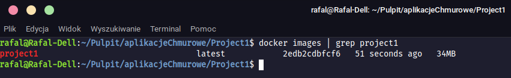
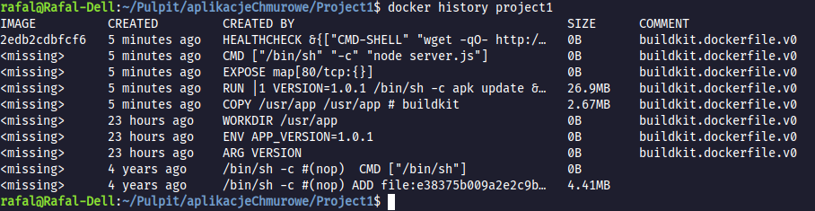
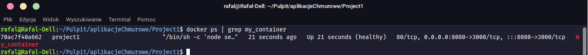
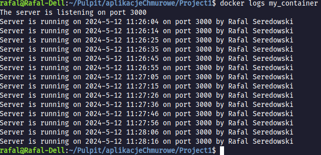
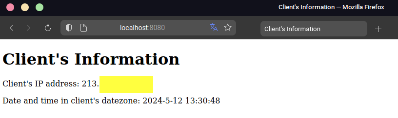
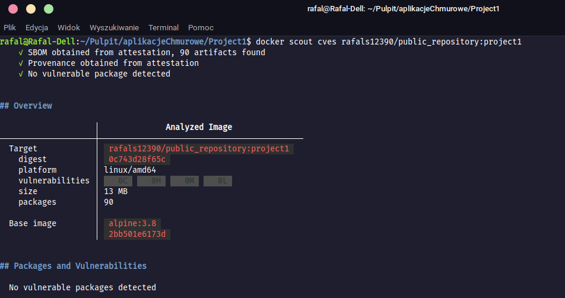

# Project 1 - Mandatory part

## What is it actually? Step by step explanation

The first stage of the project involved creating a simple application (server program) in JavaScript responsible for logging information about the server's start date, the author's name and surname, also the TCP port on which the server listens for events. Additionally, the application fetches client's information (IP address and time zone) from an [external API](http://ip-api.com/json/).
All necessary comments about how the JS application works are included along with the source code in the server.js file.
After creating the server application, I proceeded to create a Dockerfile to build a container image implementing the above functionality. The Dockerfile turned out to be quite similar to the one created during the task in [Laboratory 5](https://github.com/rafals123/Laboratorium-5). It still follows a two-stage image building process, however, in this case, I'm not using Alpine with Nginx in the second stage, but only Alpine itself, which allows for simplification of the code and, more importantly, reduction of the image size. Additionally, after testing various versions of Alpine images from [Dockerhub](https://hub.docker.com/_/alpine/tags?page=1&page_size=&name=&ordering=-last_updated), I chose Alpine version 3.8. It doesn't have any vulnerabilities, especially in the High or Critical range, and it occupies significantly less space than other versions. As a result, the final image size could be reduced to 34MB (you will see that later on the screenshot).
Finally, after the lengthy introduction, let's get to the most important part: explaining the essential commands.

# How can I build an image?
To build an image, simply run the following command in terminal:
```bash
docker build --build-arg VERSION=1.0.1 -t project1 .
```
where the "project1" is the name of your image.
Specifying the image version is optional. If you don't specify it, the version of the image will be "v1".
Once you've successfully (hopefully) built the image, you can verify if it has really been created. Simply execute the command:
```bash
docker images | grep project1
```
The result of executing the command:



## Checking image's number of layers

To check, how many layers this image has, you can type this command:
```bash
docker history project1
```
This will be the same as in the following screenshot:



# Running the container

Next, you can proceed to run the container based on the created image. To do this, you can execute the command:
```bash
docker run -d -p 8080:3000 --name my_container project1
```
where 8080 is the port number on the host mapped to port 3000 inside the container. You need to make sure that port 8080 is available on your computer. Otherwise, type a different unused port.

When you have already started the container, write the command:
```bash
docker ps | grep my_container
```
to check if the container is running.
It should show you something similar to this:

As you can see, because I used HEALTHCHECK command inside Dockerfile, we can see if a container is healthy. 
The container is in a healthy state; however, if any error occurs, the container would be considered unhealthy.
## Getting information from the server
When the container is running, you can check its logs using the following command:
```bash
docker logs my_container
```
For example, I get these logs:


## Checking how app works
When the container is running, you just need to type http://localhost:8888 in your web browser. 
The response from the server should look similar to this:

Of course, you will have a different IP address.

# Checking vulnerabilities
To check if the image has any vulnerabilities, I used the following command, using the Docker Scout tool.
As you can see on the following screenshot, there are no vulnerabilities.
