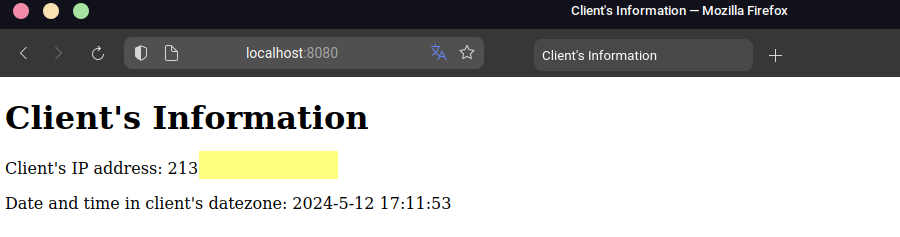

# Extended part of the project

## Basic source
To make the extended part of the project, I used some code from the solution provided in [Laboratory 6](https://github.com/rafals123/pawcho6) when creating the Dockerfile2 file.
One of the requirements for this task is to use code from a remote repository on GitHub.
To achieve this, exactly as in the Laboratory 6, it was crucial to add these commands to the Dockerfile:
```bash
apk add git
```
The above command installs the Git client.

```bash
apk add openssh-client
```
The openssh-client command is also responsible for installing the client.
These commands are necessary to fetch the source code during image building, as well as for SSH authentication. 
Moving forward, we have the following code snippet:

```bash
RUN mkdir -p -m 0700 ~/.ssh && ssh-keyscan github.com >> ~/.ssh/known_hosts \
    && eval $(ssh-agent)
```
This command creates the ~/.ssh directory (if it doesn't exist) with appropriate permissions, ensuring that only the owner will have access to this directory. Then, ssh-keyscan scans the host key for the GitHub server and adds it to the ~/.ssh/known_hosts file. This is useful to avoid warnings about unknown host keys when connecting via SSH, enabling automatic trust for the host in the future. This also prevents possible "man-in-the-middle" attacks.
Continuing further, we have the following fragment of the Dockerfile:
```bash
RUN --mount=type=ssh git clone git@github.com:rafals123/Project1.git
```
This command clones a GitHub repository using the SSH protocol, while the flag --mount=type=ssh allows mounting the SSH private key within the Docker container.

# Building an image
Before proceeding to the image building stage, it was necessary to create a new builder for the buildx tool. I made this with a following command:
```bash
docker buildx create --name builder_project1_extra --driver docker-container --bootstrap --use
```
Importantly, to ensure the image works on both linux/arm64 and linux/amd64 architectures, it was essential to use the docker-container driver.
Option --bootstrap indicates that the builder can be used immediately after creation, while the --use option means that I want to immediately specify it as the default builder for the buildx tool.
What is important, since I don't use Docker Desktop on my system (Linux Mint 21.3), it was crucial for me to execute the following command:
```bash
docker run --rm --privileged docker/binfmt:a7996909642ee92942dcd6cff44b9b95f08dad64
```
It allows registering the ARM binary format in the host system's kernel, enabling Docker containers to run on ARM architecture, even if the host system has a different architecture.
To get some important information about this, just go to the [following page](https://www.docker.com/blog/getting-started-with-docker-for-arm-on-linux/).
After the necessary configuration, we can finally proceed to the image building stage. To make this, I used the following command:
```bash
docker buildx build -t docker.io/rafals12390/project1_extra -f Dockerfile2 --build-arg VERSION=1.0.1 --ssh default=$SSH_AUTH_SOCK  --platform linux/amd64,linux/arm64 --cache-to type=registry,ref=docker.io/rafals12390/project1_extra:cache,mode=max --cache-from type=registry,ref=docker.io/rafals12390/project1_extra:cache  --push .
```
This command sets the tag and name for the resulting image with -t, specifies the Dockerfile2 to use with -f, and passes version number argument using --build-arg. Moreover, it defines the platforms to build the image for using --platform and also enables SSH agent usage during the build process with --ssh. The --cache-to fragment configures Docker Buildx to cache the build results in a specified location. Using mode=max specifies the caching mode in which Buildx will maximize the utilization of cache during the image building process. Next, --cache-to  configures Docker Buildx to store build cache in a specified location. Finally, it pushes the built image to the Docker image registry with --push.
When I used this command and there wasn't cache logs, such message appeared:

When there were cache logs, it changes to something like that:


## What can I do with this now?

First, to run this, you can download image from my Dockerhub. Just use this command:
```bash
docker pull docker.io/rafals12390/project1_extra
```
To check if the image is on your computer, type this command: 
```bash
docker images | grep project1_extra
```
The result of this command should be similar to this:

After that, you just need to run a container with a command same as before:
```bash
docker run -d -p 8080:3000 --name my_container2 rafals12390/project1_extra
```
I stopped previous container, so I can run this (the port was free). You need to make sure that you do the same, or else, just use some other port.

## Checking how app works
Same as before, just type http://localhost:8080 (or some other port).
